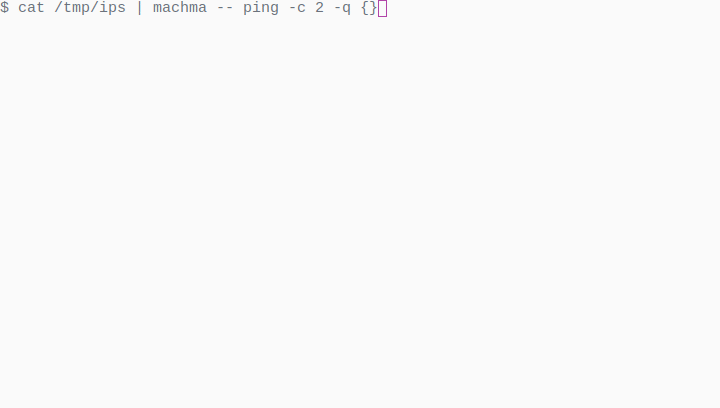

# machma - Easy parallel execution of commands with live feedback

## Introduction

In order to fully utilize modern machines, jobs need to be run in parallel. For
example, resizing images sequentially takes a lot of time, whereas working on
multiple images in parallel makes much better use of a multi-core CPU and
therefore is much faster. This tool makes it very easy to execute tasks in
parallel and provides live feedback. In case of errors or lines printed by the
program, the messages are tagged with the job name.

`machma` by default reads newline-separated values and replaces all
command-line arguments set to `{}` with the file name. The number of jobs is
set to the number of cores for the CPU of the host `machma` is running on.

## Sample Usage

Resize all images found in the current directory and sub-directories to
1200x1200 pixel at most:

```shell
$ find . -iname '*.jpg' | machma --  mogrify -resize 1200x1200 {}
```

The command specified after the double dash (`--`) is executed with each
parameter that is set to `{}` replaced with the file name. At the bottom, a few
status lines are printed after a summary line. The lines below visualize the
status of the instances of the program running in parallel. The line for an
instance will either contain the name of the file (in this case) that is being
processed followed by the newest message printed by the program.


Ping a large number of hosts, but only run two jobs in parallel:

```shell
$ cat /tmp/ip-address-list | machma -p -- ping -c 2 -q {}
```

The program `ping` will exit with an error code when the host is not reachable,
and `machm` prints an error message for all jobs which returned an error code.



## Installation

Installation is very easy, install a recent version of Go and run:

```shell
$ go get github.com/fd0/machma
```

Afterwards you can view the online help:
```shell
$ machma --help
Usage of machma:
  -0, --null             use null bytes as input separator
  -p, --procs int        number of parallel porgrams (default 4)
      --replace string   replace this string in the command to run (default "{}")
```
